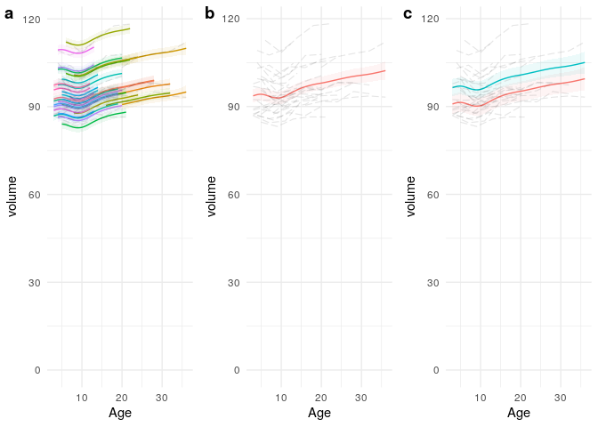
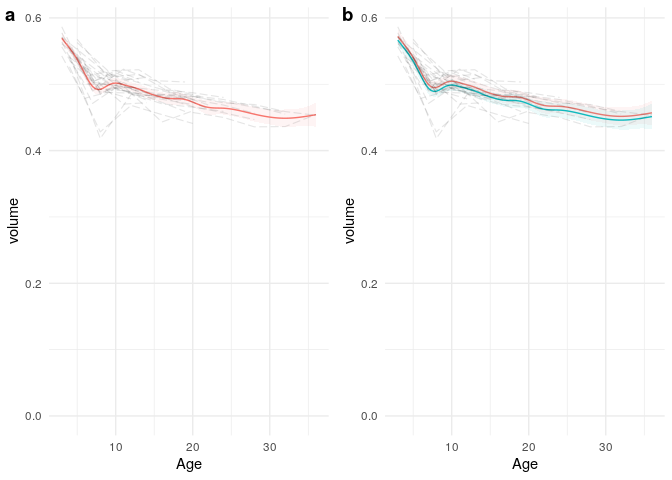

# Introduction

Example `R` code to perform longitudinal modelling of brain volumes as in [Ball & Seal 2019](https://link.springer.com/article/10.1007%2Fs00429-019-01829-5)

Please see the paper for details on brain tissue volume extraction and statistical modelling. Volumetric data were derived from the UNC-Wisconsin Rhesus Macaque Neurodevelopment Database. Please cite: 
>Young JT, Shi Y, Niethammer M, Grauer M, Coe CL, Lubach GR, Davis B, Budin F, Knickmeyer RC, Alexander AL, Styner MA. 2017. The UNC-Wisconsin Rhesus Macaque Neurodevelopment Database: A Structural MRI and DTI Database of Early Postnatal Development. Front Neurosci. 11.

This repository contains the code in the file `run_models.R` and the data in `brain_tissue_volumes.csv`. This
R markdown document contains a walkthrough of the procedures, including display of the code and results. It can
be reproduced by cloning the repository, loading the `Readme.Rmd` file in rstudio, and pressing the `Knit` button.

## Setup

Load required libraries. Attempt to install missing ones. Set up plotting tools.

```r
rqpackages <- c('tidyverse', 'mgcv', 'cowplot', 'itsadug', 'grid', "lmerTest")
missingpackages <- setdiff(rqpackages, rownames(installed.packages()))
if (length(missingpackages) > 0) {
  install.packages(missingpackages)
}
library('tidyverse')
library('mgcv')
library('cowplot')
library('itsadug')
library('grid')

# plotting function
plotter <- function(plot_data, orig_data, fit_xx, fit_yy, orig_xx, orig_yy, fit_grp, orig_grp, lower="lower", upper="upper") {
  ggplot(data=plot_data) +
                 geom_line(aes_string(x = fit_xx, y = fit_yy, group = fit_grp, colour=fit_grp), show.legend = FALSE) +
                 geom_ribbon(aes_string(x = fit_xx, ymin = lower, ymax = upper, fill = fit_grp), alpha=0.075, show.legend=FALSE) +
                 geom_line(data=orig_data, aes_string(x = orig_xx, y = orig_yy, group = orig_grp), alpha=.1, size=.4, linetype=5, show.legend = FALSE) + 
                 expand_limits(y=0) +
                 labs(x = "Age", y = "volume")  +
                 theme_minimal() 
}

# function to create individual data for plotting trajectories
expand_data <- function(data){
  expanded_data = NULL
  for (id in unique(data$ID)){
    age_seq = seq(from=min(data[data$ID==id,][,4]), to=max(data[data$ID==id,][,4]), length.out=50)
    expid = expand.grid(ID=id, Male=data[data$ID==id,][[1,3]], Age=age_seq)
    expanded_data=rbind(expanded_data, expid)
  }
  return(expanded_data)
}
```

## Load and format data
Formatting the data units, globally setting the k for GAMS.

```r
####################################################################################
# Setup and load data
####################################################################################
# default k for GAMs
k=20

# load data
data <- as_tibble(read.csv('./brain_tissue_volumes.csv')[ ,2:14])
data$ID <- as.factor(data$ID)

# convert volume to ml (mm3/1000)
data$ICV <- data$ICV/1000
data$corticalGM <- data$corticalGM/1000
data$subcorticalGM <- data$subcorticalGM/1000
data$WM <- data$WM/1000
data$cerebellum <- data$cerebellum/1000

# Fit models 
```

## Intracranial volume trajectories

Test some multi-level models with combinations of age and sex, and a GAM model with a smooth function of age.

```r
##########################################################################
# Intracranial Volume (ICV)
##########################################################################
# Start with a linear mixed effect models with random intercepts, modelling the dependence of tissue volume on sex. 
model0 <- lmerTest::lmer(ICV ~ 1 + (1 + 1|ID) + Male, data=data, REML=F)

# Then add in Age... 
model1 <- lmerTest::lmer(ICV ~ 1 + (1 + 1|ID) + Age + Male, data=data, REML=F)

# Then model age as a smooth function with a GAM...
modelGAM <- gam(ICV ~ 1 + s(ID, bs="re") + s(Age, k=k) + Male, method="ML", data=data)
```

Now compare the models.

```r
# compare models with AIC
model_selection = AIC(model0,model1,modelGAM)
print(model_selection)
```

```
##                df      AIC
## model0    4.00000 785.1602
## model1    5.00000 725.4776
## modelGAM 41.61288 587.7114
```

Also compare to model with random slope.

```r
# and finally, compare to the inclusion of random slopes as well
modelGAMslope <- gam(ICV ~ 1 + s(ID, bs="re") + s(ID, Age, bs="re") + s(Age, k=k) + Male, method="ML", data=data)
gam_model_selection <- AIC(modelGAM, modelGAMslope)
compareML(modelGAM, modelGAMslope, suggest.report = T)
```

```
## modelGAM: ICV ~ 1 + s(ID, bs = "re") + s(Age, k = k) + Male
## 
## modelGAMslope: ICV ~ 1 + s(ID, bs = "re") + s(ID, Age, bs = "re") + s(Age, k = k) + 
##     Male
## 
## Report suggestion: The Chi-Square test on the ML scores indicates that model modelGAMslope is [marginally / significantly] better than model modelGAM (X2(1.00)=2.861, p0.017).
## -----
##           Model   Score Edf Difference    Df p.value Sig.
## 1      modelGAM 351.386   5                              
## 2 modelGAMslope 348.525   6      2.861 1.000   0.017  *  
## 
## AIC difference: 28.84, model modelGAMslope has lower AIC.
```

```
## Warning in compareML(modelGAM, modelGAMslope, suggest.report = T): Only small difference in ML...
```

Set up data for plotting

```r
####################################################################################
# Plot models
####################################################################################
# choose model to plot: modelGAM, modelGAMslope - check lines 105 and 128 if using modelGAMslope
plot_model <- modelGAM

####################################################################################
# Individual trajectories
expanded_data <- expand_data(data)
```

Perform predictions

```r
# model predictions
predictions <- predict(plot_model, newdata=expanded_data, se.fit = T)
predicted_data <- data.frame(predictions$fit , predictions$se.fit)
colnames(predicted_data) <- c("fit","se")
# CI
predicted_data$upper <- predicted_data$fit  + 1.96*(predicted_data$se)
predicted_data$lower <- predicted_data$fit  - 1.96*(predicted_data$se)

# collect prediction, lower and upper CI together
tempdf <- bind_cols(expanded_data, predicted_data)
```

Create individual plots, to be combined with others below.

```r
# plot individual fits
plot_ICV_1 <- plotter(tempdf, data, "Age", "fit", "Age", "ICV", fit_grp="ID", orig_grp="ID")
```

Set up plots of average trajectories, and male and female trajectories.

```r
####################################################################################
# Average trajectories
age_sequence <- seq(from=min(data$Age),to=max(data$Age), length.out=100)
all_x <- expand.grid(ID=1, #ignored
                     Male=0.5,
                     Age=age_sequence)

# model predictions without random effects
predictions <- predict(plot_model, newdata=all_x, se.fit = T, exclude=c(s(ID)))
#predictions <- predict(plot_model, newdata=all_x, se.fit = T, exclude = c(s(ID), s(ID,Age))) # use for modelGAMslope
predicted_data <- data.frame(fit=predictions$fit , se=predictions$se.fit)
# CI
predicted_data$upper <- predicted_data$fit  + 1.96*(predicted_data$se)
predicted_data$lower <- predicted_data$fit  - 1.96*(predicted_data$se)

# collect prediction, lower and upper CI together
tempdf <- bind_cols(all_x, predicted_data)
tempdf$ID <- factor(tempdf$ID)

# plot group average fit
plot_ICV_2 <- plotter(tempdf, data, "Age", "fit", "Age", "ICV", fit_grp="ID", orig_grp="ID")
```


```r
####################################################################################
# Male and female trajectories
male_x <- all_x
male_x$Male <- c(1)
female_x <- all_x
female_x$Male <- c(0)
all_x <- rbind(male_x, female_x)

# model predictions without random effects
predictions <- predict(plot_model, newdata=all_x, se.fit = T, exclude = c(s(ID)))
#predictionsm <- predict(plot_model, newdata=all_x, se.fit = T, exclude = c(s(ID), s(ID,Age))) # use for modelGAMslope
predicted_data <- data.frame(fit=predictions$fit , se=predictions$se.fit)
# CI
predicted_data$upper <- predicted_data$fit  + 1.96*(predicted_data$se)
predicted_data$lower <- predicted_data$fit  - 1.96*(predicted_data$se)

# collect prediction, lower and upper CI together
tempdf <- bind_cols(all_x, predicted_data)
tempdf$Male <- factor(tempdf$Male)

# plot trajectories
plot_ICV_3 <-  plotter(tempdf, data, "Age", "fit", "Age", "ICV", fit_grp="Male", orig_grp="ID")
```

Display the plots


## Grey-matter volume trajectories

Apply the same procedure to GM volumes.

First fit the models, compare, and check for random slopes.


```r
####################################################################################
# Regional tissue volume, correcting for ICV
# in this case using corticalGM, edit as required.
####################################################################################
# run models
model0tissue <- lmerTest::lmer(corticalGM ~ 1 + (1 + 1|ID) + ICV + Male, data=data, REML=F)
model1tissue <- lmerTest::lmer(corticalGM ~ 1 + (1 + 1|ID) + Age + ICV + Male, data=data, REML=F)
modelGAMtissue <- gam(corticalGM ~ 1 + s(ID, bs="re") + s(Age, k=k) + ICV + Male, method="ML", data=data)
modelGAMtissueslope <- gam(corticalGM ~ 1 + s(ID, bs="re") +  s(ID, Age, bs="re") + s(Age, k=k) + ICV + Male, method="ML", data=data)

# compare models with AIC
tissue_model_selection = AIC(model0tissue,model1tissue,modelGAMtissue)
print(tissue_model_selection)
```

```
##                      df      AIC
## model0tissue    5.00000 725.7366
## model1tissue    6.00000 617.0833
## modelGAMtissue 41.34702 456.0604
```

```r
compareML(modelGAMtissue, modelGAMtissueslope, suggest.report = T)
```

```
## modelGAMtissue: corticalGM ~ 1 + s(ID, bs = "re") + s(Age, k = k) + ICV + Male
## 
## modelGAMtissueslope: corticalGM ~ 1 + s(ID, bs = "re") + s(ID, Age, bs = "re") + s(Age, 
##     k = k) + ICV + Male
## 
## Model modelGAMtissue preferred: lower ML score (0.000), and lower df (1.000).
## -----
##                 Model    Score Edf Difference     Df
## 1 modelGAMtissueslope 258.9568   7                  
## 2      modelGAMtissue 258.9568   6      0.000 -1.000
## 
## AIC difference: -0.00, model modelGAMtissue has lower AIC.
```

```
## Warning in compareML(modelGAMtissue, modelGAMtissueslope, suggest.report = T): Only small difference in ML...
```

```r
####################################################################################
# Plot models 
####################################################################################
# Tissue volume
# choose model to plot: modelGAM, modelGAMslope - check lines 186, 194 and 217 if using modelGAMslope
plot_model <- modelGAMtissue
```

Prepare data for and predict the average trajectories.

```r
####################################################################################
# Average trajectories
age_sequence <- seq(from=min(data$Age),to=max(data$Age), length.out=100)
all_x <- expand.grid(ID=1,
                     Male=0.5,
                     ICV=mean(data$ICV),
                     Age=age_sequence)

# refit model on ICV-corrected tissue volume data using same smoothing parameters for Age and ID
data_tmp <- data
data_tmp$corticalGM <- data_tmp$corticalGM/data_tmp$ICV
tmp_model <- gam(formula(plot_model),
                 sp = c(plot_model$sp["s(ID)"],
                        plot_model$sp["s(Age)"]),
                 method="ML", data=data_tmp)
#tmp_model <- gam(formula(plot_model),                       # use this instead for modelGAMslope
#                 sp = c(plot_model$sp["s(ID)"],
#                        plot_model$sp["s(ID,Age)"],
#                        plot_model$sp["s(Age)"]),
#                 method="ML", data=data_tmp)
```


```r
# model predictions without random effects
predictions <- predict(tmp_model, newdata=all_x, se.fit = T, exclude=c(s(ID)))
#predictions <- predict(tmp_model, newdata=all_x, se.fit = T, exclude=c(s(ID), s(ID,Age)))  # if using modelGAMslope
predicted_data <- data.frame(fit=predictions$fit , se=predictions$se.fit)
# CI
predicted_data$upper <- predicted_data$fit  + 1.96*(predicted_data$se)
predicted_data$lower <- predicted_data$fit  - 1.96*(predicted_data$se)

# collect prediction, lower and upper CI together
tempdf <- bind_cols(all_x, predicted_data)
tempdf$ID <- factor(tempdf$ID)

# plot group average fit
plot_tissue_1 <- plotter(tempdf, data_tmp, "Age", "fit", "Age", "corticalGM", "ID", "ID")
```

Prepare data and predict trajectories based on sex.


```r
####################################################################################
# Male and female trajectories
male_x <- all_x
male_x$Male <- c(1)
female_x <- all_x
female_x$Male <- c(0)
all_x <- rbind(male_x, female_x)
```

```r
# model predictions without random effects
predictions <- predict(tmp_model, newdata=all_x, se.fit = T, exclude=c(s(ID)))
#predictions <- predict(tmp_model, newdata=all_x, se.fit = T, exclude=c(s(ID), s(ID,Age)))  # if using modelGAMslope
predicted_data <- data.frame(fit=predictions$fit , se=predictions$se.fit)
# CI
predicted_data$upper <- predicted_data$fit  + 1.96*(predicted_data$se)
predicted_data$lower <- predicted_data$fit  - 1.96*(predicted_data$se)

# collect prediction, lower and upper CI together
tempdf <- bind_cols(all_x, predicted_data)
tempdf$Male <- factor(tempdf$Male)

# plot
plot_tissue_2 <- plotter(tempdf, data_tmp, "Age", "fit", "Age", "corticalGM", "Male", "ID")
```
Display the trajectories for GM.




